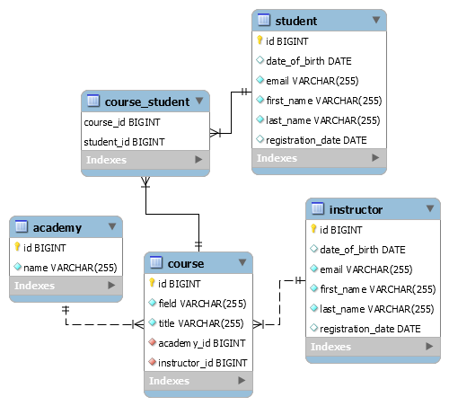

# Java Backend Demo Project

[](https://circleci.com/gh/pablozoani/java-backend-demo)

## Run in terminal from the root folder

```java
mvn spring-boot:run
```

## File tree on initial commit

```java
java-backend-demo
 ├── pom.xml
 ├── README.md
 └─> src
     ├─> main
     │   ├─> java
     │   │   └─> com
     │   │       └─> pablozoani
     │   │           ├─> designpattern
     │   │           │   ├─> a_decorator
     │   │           │   │   ├── Main.java
     │   │           │   │   ├── Phasor.java
     │   │           │   │   ├── SignalGenerator.java
     │   │           │   │   ├── SineWaveGenerator.java
     │   │           │   │   └── TriangularWaveGenerator.java
     │   │           │   ├─> b_builder
     │   │           │   │   ├── AddressBuilder.java
     │   │           │   │   ├── AddressBuilderImpl.java
     │   │           │   │   ├── AddressBuilders.java
     │   │           │   │   └── Main.java
     │   │           │   ├─> c_strategy
     │   │           │   │   ├── AlphabeticalSort.java
     │   │           │   │   ├── BabyNameList.java
     │   │           │   │   ├── LengthBasedSort.java
     │   │           │   │   ├── Main.java
     │   │           │   │   ├── StringArraySortAlgorithm.java
     │   │           │   │   └── StringArraySortAlgorithms.java
     │   │           │   ├─> d_observer
     │   │           │   │   ├── Main.java
     │   │           │   │   ├── Message.java
     │   │           │   │   ├── Receiver.java
     │   │           │   │   ├── Sender.java
     │   │           │   │   └── User.java
     │   │           │   ├─> reusable_entities
     │   │           │   │   ├── Address.java
     │   │           │   │   ├── BankAccount.java
     │   │           │   │   ├── Customer.java
     │   │           │   │   ├── Person.java
     │   │           │   │   └── Product.java
     │   │           │   ├── Singleton.java
     │   │           │   └─> z_trash
     │   │           │       ├─> designpattern
     │   │           │       │   ├─> builder
     │   │           │       │   │   ├── CarBuilder.java
     │   │           │       │   │   ├── Director.java
     │   │           │       │   │   ├── Main.java
     │   │           │       │   │   ├── MotorCycleBuilder.java
     │   │           │       │   │   ├── Product.java
     │   │           │       │   │   └── VehicleBuilder.java
     │   │           │       │   ├─> decorator2
     │   │           │       │   │   ├── IceCream.java
     │   │           │       │   │   ├── IceCreamDecorator.java
     │   │           │       │   │   ├── IceCreamImpl.java
     │   │           │       │   │   ├── IceCreamPrefixer.java
     │   │           │       │   │   ├── IceCreamSuffixer.java
     │   │           │       │   │   └── Main.java
     │   │           │       │   ├─> decorator3
     │   │           │       │   │   ├── ConcreteHouse.java
     │   │           │       │   │   ├── FloorDecorator.java
     │   │           │       │   │   ├── House.java
     │   │           │       │   │   ├── HouseDecorator.java
     │   │           │       │   │   ├── Main.java
     │   │           │       │   │   └── PaintDecorator.java
     │   │           │       │   ├─> decorator4
     │   │           │       │   │   ├── Main.java
     │   │           │       │   │   ├── OpenPTrackData.java
     │   │           │       │   │   ├── OpenPTrackDataDecorator.java
     │   │           │       │   │   ├── OpenPTrackDataImpl.java
     │   │           │       │   │   ├── OpenPTrackDataOffset.java
     │   │           │       │   │   └── OpenPTrackDataScale.java
     │   │           │       │   ├─> observer
     │   │           │       │   │   ├── Blog.java
     │   │           │       │   │   ├── Main.java
     │   │           │       │   │   ├── Observer.java
     │   │           │       │   │   ├── Subject.java
     │   │           │       │   │   └── User.java
     │   │           │       │   ├─> prototype
     │   │           │       │   │   ├── BasicCar.java
     │   │           │       │   │   ├── Ford.java
     │   │           │       │   │   ├── Main.java
     │   │           │       │   │   └── Nano.java
     │   │           │       │   ├─> proxy
     │   │           │       │   │   ├── ConcreteSubject.java
     │   │           │       │   │   ├── Main.java
     │   │           │       │   │   ├── Subject.java
     │   │           │       │   │   └── SubjectProxy.java
     │   │           │       │   └─> singleton
     │   │           │       │       └── Captain.java
     │   │           │       └─> models
     │   │           │           ├─> artist
     │   │           │           │   ├── Artist.java
     │   │           │           │   ├── Book.java
     │   │           │           │   ├── Composer.java
     │   │           │           │   ├── diagram.png
     │   │           │           │   ├── diagram.puml
     │   │           │           │   ├── LiteraryGenre.java
     │   │           │           │   ├── MusicPiece.java
     │   │           │           │   ├── Painter.java
     │   │           │           │   ├── Performable.java
     │   │           │           │   ├── Performer.java
     │   │           │           │   ├── Picture.java
     │   │           │           │   ├── Producer.java
     │   │           │           │   ├── Program.java
     │   │           │           │   ├── Sculptor.java
     │   │           │           │   ├── Sculpture.java
     │   │           │           │   ├── Work.java
     │   │           │           │   └── Writer.java
     │   │           │           ├─> house
     │   │           │           │   ├── diagram.png
     │   │           │           │   ├── diagram.puml
     │   │           │           │   ├── Dimensions.java
     │   │           │           │   ├── Factory.java
     │   │           │           │   ├── Floor.java
     │   │           │           │   ├── FloorImpl.java
     │   │           │           │   ├── House.java
     │   │           │           │   ├── Main.java
     │   │           │           │   └─> rooms
     │   │           │           │       ├── BathRoom.java
     │   │           │           │       ├── BedRoom.java
     │   │           │           │       ├── DiningRoom.java
     │   │           │           │       ├── Kitchen.java
     │   │           │           │       ├── LivingRoom.java
     │   │           │           │       ├── Room.java
     │   │           │           │       └── RoomType.java
     │   │           │           └─> store
     │   │           │               ├── Aisle.java
     │   │           │               ├── diagram.png
     │   │           │               ├── diagram.puml
     │   │           │               ├── Main.java
     │   │           │               ├── Product.java
     │   │           │               ├── ProductImpl.java
     │   │           │               ├── Shelf.java
     │   │           │               └── Store.java
     │   │           ├─> utils
     │   │           │   └── ConsoleColors.java
     │   │           └─> webapp
     │   │               ├─> init
     │   │               │   └── StartUp.java
     │   │               ├─> layers
     │   │               │   ├─> business
     │   │               │   │   ├─> controller
     │   │               │   │   ├─> dto
     │   │               │   │   ├─> repository
     │   │               │   │   │   ├── AcademyDAO.java
     │   │               │   │   │   ├── AcademyDAOImpl.java
     │   │               │   │   │   ├─> base
     │   │               │   │   │   │   ├── BaseDAO.java
     │   │               │   │   │   │   ├── BasePersonDAO.java
     │   │               │   │   │   │   └── PersonDAO.java
     │   │               │   │   │   ├── CourseDAO.java
     │   │               │   │   │   ├── CourseDAOImpl.java
     │   │               │   │   │   ├── InstructorDAO.java
     │   │               │   │   │   ├── InstructorDAOImpl.java
     │   │               │   │   │   ├── StudentDAO.java
     │   │               │   │   │   └── StudentDAOImpl.java
     │   │               │   │   └─> service
     │   │               │   │       ├── AcademyService.java
     │   │               │   │       ├── CourseService.java
     │   │               │   │       ├── InstructorService.java
     │   │               │   │       └── StudentService.java
     │   │               │   └─> model
     │   │               │       ├── Academy.java
     │   │               │       ├─> base
     │   │               │       │   ├── BaseEntity.java
     │   │               │       │   ├── FieldOfStudy.java
     │   │               │       │   └── Person.java
     │   │               │       ├── Course.java
     │   │               │       ├── Instructor.java
     │   │               │       └── Student.java
     │   │               └── Main.java
     │   └─> resources
     │       └── application.yml
     └─> test
         └─> java
             ├─> com
             │   └─> pablozoani
             │       └─> webapp
             │           └─> layers
             │               └─> business
             │                   └─> repository
             │                       └── RepositoryTEST.java
             └── ObjectTest.java
```

## Entity relationship diagram


